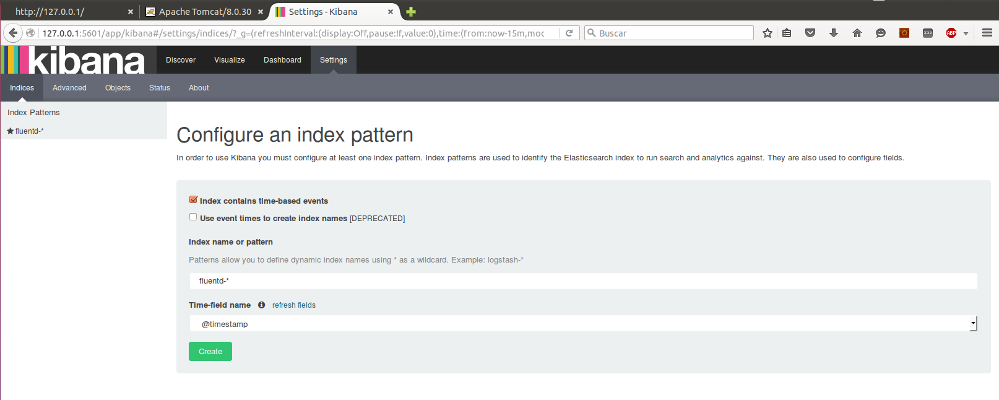
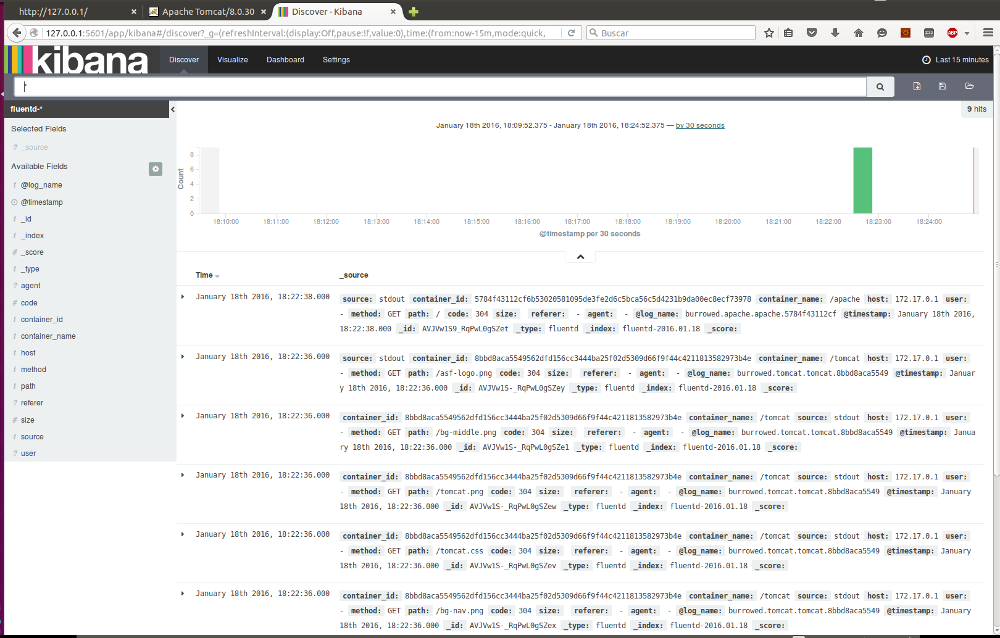

#Fluentd and Fluentd-forwarding
##Steps for deploy
###1) Deploy coco.yml
    docker-compose -f coco.yml up
coco is a container that emulates the cloudopting machine
###2) Deploy monitor.yml into coco
    docker exec -it coco bash
    cd /home/coco/compose
    docker-compose -f monitor.yml
monitor.yml deploys three containers into coco, fluentd (port 24224), elasticsearch and kibana (port 5601)
fluentd uses a ssl connection
###3) Add coco IP to /etc/host in emulatedhost container
You can know this IP if you typing the command:

    docker inspect --format '{{ .NetworkSettings.Networks.bridge.IPAddress }}' coco
And add it to /etc/host in emulatedhost:

    docker exec -it co_emulatedhost sh
    echo "coco_IP CloudOpting" >> /etc/hosts
**Note:** This was done considering the real case. Manager should contain in /etc/hosts the Cloudopting machine IP
###4) Deploy into "virtual machine" with cloudopting-crane
**Note:** We will not use a real virtual machine, we'll use emulatedhost container with cloudopting-crane in development mode.
####4.1) Clone cloudopting-crane project
git clone https://github.com/CloudOpting/cloudopting-crane.git
####4.2) Generate certificates
    ./genCerts
####4.3) Add fluentd certificates
Add yours certificates to cloudopting-crane/test/emulatedhost/certs and cloudopting-fluentd/certs
####4.4) Expose ports 80 and 8080 in emulatedhost
add in service emulatedhost in development.yml file:

    ports:
      - "80:80"
      - "8080:8080"
####4.5) Deploy cloudopting-crane
    docker-compose -f development.yml up
####4.6) Use the crane interfaces in 127.0.0.1:8888
######Context:

    group: empty or default
    puppetfile: use ./covm/puppetfile

######Images:

    name: apache
    dockerfile: ./covm/apache/Dockerfile
    manifest: empty

    name: tomcat
    dockerfile: ./covm/tomcat/Dockerfile
    manifest: ./covm/tomcat/tomcat.pp

    name: fforwarding
    dockerfile: ./covm/fluentd-forwarding/Dockerfile
    manifest: ./covm/fluentd-forwarding/fforwarding.pp

######Cluster:
    ProvisioedSingleManchine: endpoint: http://emulatedhost:4243

######Composer:
    composefile: fluentd-forwarding.yml
    composefile: application.yml
**Note:** First you must deploy fluentd-forwarding.yml
##Use
**_Apache:_** you can access to Apache in localhost:80
**_Tomcat:_** you can accesee to Tomcat in localhost:8080
**_Kibana:_** you can access to Kibana in localhost:5601. In settings use pattern fluentd-*

##Real case considerations
####Cloudopting machine
######1) You don't need deploy coco, you must deploy monitor.yml in cloudopting machine
######2) In monitor.yml: Replace the cert path and conf path
######3) In cloudopting.conf: Change shared-key, ca_private_key_passphrase and certificates names
######4) /etc/hosts in virtual machine must include CloudOpting IP
##Virtual machine
######1) Puppetfile is necesary, although it's empty
######2) You must deploy fluentd-forwarding.yml before application.yml
######3) fforwarding.pp:

    Shared_key: Use the same key that fluentd from cloudopting machine
    ca_cert.pem: Replace it with your certificate
######4) fluentd-forwarding.yml:

    Replace host certificates path
